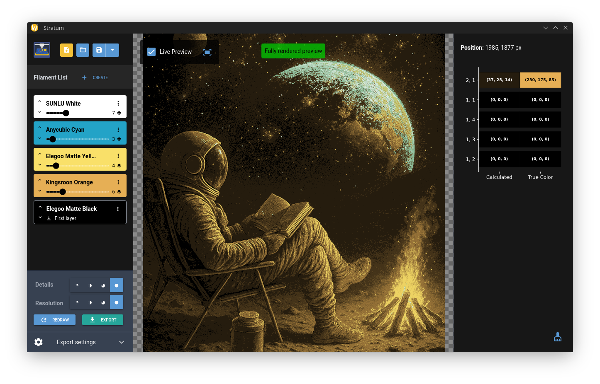
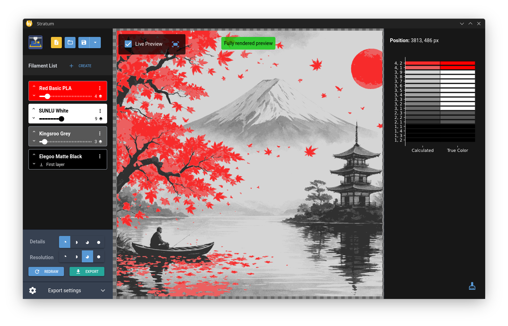

# Stratum

 

**Transform any image into stunning multi-color 3D prints with intelligent layering**

Stratum is a powerful desktop application that converts 2D images into multi-layered STL files optimized for multi-color 3D printing. Using advanced segmentation algorithms and material science principles, it automatically generates the optimal layer structure for creating vibrant, detailed 3D prints with multiple filaments.

## ✨ Features

### 🎨 **Intelligent Color Segmentation**
- Advanced image processing algorithms automatically segment your images by color
- Smart shade generation based on filament transparency and layering physics
- Real-time live preview with instant feedback

### 🧵 **Filament Management System**
- Built-in filament library with material properties
- Custom filament creation with transparency values (Td)
- Project-specific layer count configuration
- Visual filament ordering and management

### 🔧 **Advanced Processing Controls**
- **Resolution modes**: From draft (◔) to ultra-high quality (●)
- **Detail levels**: Control fine feature preservation
- **Layer height**: Customizable from 0.001mm to 10mm
- **Size optimization**: Automatic scaling to target dimensions

### 📊 **Interactive Preview System**
- **Live Preview**: Real-time updates as you adjust settings
- **Full Render**: High-quality final preview with polygon generation
- **Click Analysis**: Detailed layer information at any point
- **Zoom & Pan**: Navigate large images with precision

### 💾 **Project Management**
- Save and load complete projects with all settings
- Native file dialogs for seamless workflow
- Automatic project state preservation
- Export ready-to-print STL files

## 🚀 Installation

### Option 1: Download Pre-built Binary (Recommended)
1. Go to the [Releases](../../releases) page
2. Download the latest version for your operating system
3. Extract and run the executable
4. No additional setup required!

### Option 2: Install from Source
Requires Python 3.8 or newer.

```bash
# Clone the repository
git clone https://github.com/yourusername/Stratum.git
cd Stratum

# Install dependencies
pip install -r requirements.txt

# Run the application
python main.py
```

### Dependencies
- **nicegui**: Modern web-based UI framework
- **numpy**: Numerical computing
- **Pillow**: Image processing
- **scikit-image**: Advanced image analysis
- **trimesh**: 3D mesh generation and processing
- **shapely**: Geometric operations
- **matplotlib**: Visualization and plotting
- **geopandas**: Geospatial data processing
- **pywebview**: Native window support

## 📖 How to Use

### 1. **Load Your Image**
- Support for all common image formats (PNG, JPG, JPEG, etc.)
- RGBA images preserve transparency
- Works best with high-contrast images

### 2. **Add Filaments**
- Click the "Create" button to access the filament library
- Add filaments in the order they'll be printed (bottom to top)
- Adjust layer counts for each filament
- Minimum 2 filaments required

### 3. **Configure Settings**
- **Layer Height**: Match your 3D printer's capabilities
- **Base Layers**: Number of solid base layers for adhesion
- **Max Size**: Target print dimensions in centimeters
- **Resolution/Detail**: Balance between quality and processing time

### 4. **Preview and Refine**
- Enable **Live Preview** for real-time feedback
- Use **Redraw** for full-quality rendering
- Click anywhere on the preview to see layer composition
- Adjust settings and see immediate results

### 5. **Export for Printing**
- Click **Export** to generate STL files
- One STL file per filament layer
- Drag all files at once into your slicer and import as a single object
- Either print using a multicolor capable printer or switch filament manually


## 🎯 Best Practices

### Image Preparation
- **High contrast images** work best
- **Simple color schemes** Avoid images using many different unrelated colors
- **PNG format** recommended for best quality
- **Transparent backgrounds** are supported for sophisticated shapes

### Filament Selection
- Start with **2-3 filaments** for your first projects
- Use **contrasting colors** for better visual separation
- Find out the TD-value of your filament, (for e.g. https://3dfilamentprofiles.com/)
- **White or black base layers** are good for getting started

### Print Settings
- Use **0.1-0.2mm layer heights** for best detail
- **3-5 base layers** ensure good bed adhesion
- **Slower print speeds** for multi-layer precision

## 🔬 Technical Details

### Color Processing Algorithm
Stratum uses multiple stages to convert images into 3D printable files:

1. **Shade Generation**: Creates intermediate colors based on filament transparency and layer counts
2. **Image Segmentation**: Maps input pixels to achievable color combinations
3. **Polygon Creation**: Converts segmented regions into clean geometric shapes
4. **Mesh Generation**: Builds 3D models with precise layer heights

### Supported Formats
- **Input**: PNG, JPG, JPEG, BMP, TIFF, WEBP
- **Output**: STL (one file per filament layer)
- **Projects**: JSON format with embedded image data

## 🛠️ Command Line Options

```bash
# Run in browser mode (no native window)
python main.py --browser

# Load a project file on startup
python main.py --project /path/to/project.json
python main.py -p /path/to/project.json

# Enable hot reload for development
python main.py --reload
```

## 🎨 Example Workflow

1. **Prepare Image**: Choose a high-contrast logo or artwork
2. **Add Base Filament**: White or light-colored base material
3. **Add Detail Filaments**: Colors for your design elements
4. **Set Layer Height**: 0.08mm or lower for detailed prints
5. **Configure Size**: Target your printer's build volume
6. **Live Preview**: Fine-tune settings in real-time
7. **Full Render**: Generate final preview
8. **Export STL**: Get ready-to-print files
9. **Slice & Print**: Use a multicolor capable printer or switch filaments manually

## 🐛 Troubleshooting

### Common Issues

**"Load image and add at least two filaments"**
- Ensure you've loaded an image file
- Add minimum 2 filaments to your project

**Rendered result appears blocky or low quality**
- Increase resolution mode (◑ → ◕ → ●)
- Use higher detail settings
- Try a higher resolution source image

**Export takes very long**
- Reduce detail level for faster processing
- Lower resolution mode for testing
- Smaller target print sizes process faster
- Be patient - complex images will take their time. Use the live preview for calibrating your filaments.

**Colors don't match expected results**
- Check your filaments TD values
- Consider filament order (bottom to top)
- Some combinations may not be achievable

### Performance Tips
- **Live Preview**: Great for quick adjustments
- **Full Render**: Use only when satisfied with settings
- **Image Size**: Larger images take exponentially longer
- **Layer/Filament Count**: More layers = longer processing time

## 🤝 Contributing

We welcome contributions! Here's how you can help:

1. **Bug Reports**: Use the Issues tab to report problems
2. **Feature Requests**: Suggest new functionality
3. **Code Contributions**: Submit pull requests
4. **Documentation**: Help improve this README
5. **Testing**: Try the software and share feedback

### Development Setup
```bash
git clone https://github.com/yourusername/Stratum.git
cd Stratum
pip install -r requirements.txt
python main.py --reload  # Enable hot reload
```

## 📄 License

This project is licensed under the MIT License - see the [LICENSE](LICENSE) file for details.

## 🙏 Acknowledgments

- Built with [NiceGUI](https://nicegui.io/) for the modern web interface
- Image processing powered by [scikit-image](https://scikit-image.org/)
- 3D mesh generation using [trimesh](https://trimsh.org/) and [geopandas](https://geopandas.org/)
- Geometric operations via [Shapely](https://shapely.readthedocs.io/)

---

**Ready to revolutionize your 3D printing workflow?** Download Stratum today and start creating stunning multi-color prints from any image!

⭐ **Like this project?** Give us a star on GitHub to show your support!
