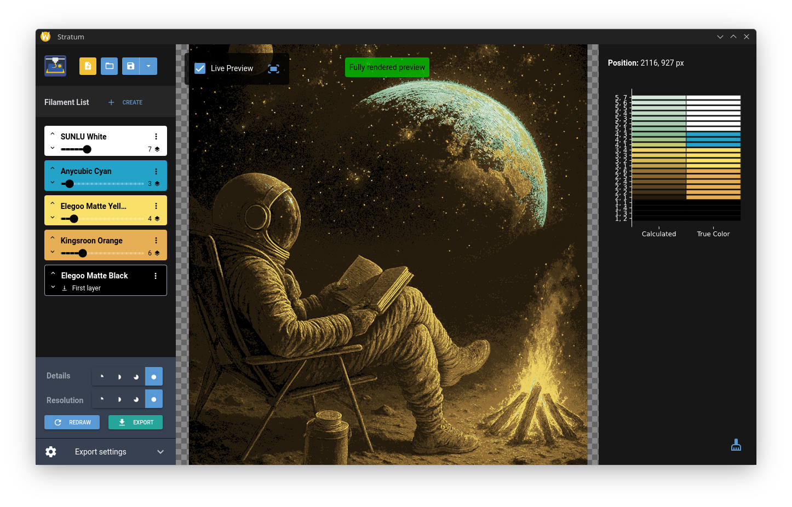

# Stratum

 
 

**Convert 2D images into multi-layered STL files for multi-color 3D printing**

Stratum is a desktop application designed to help users transform 2D images into STL files optimized for multi-color 3D printing. It uses image segmentation and layering techniques to generate 3D models that can be printed with multiple filaments.

## Features

### Intelligent Color Segmentation
- Image processing algorithms segment images by color.
- Shade generation based on filament transparency and layering.
- Live preview for quick feedback.

### Filament Management System
- Filament library with material properties.
- Custom filament creation with transparency values.
- Layer count configuration for projects.
- Visual filament ordering.

### Processing Controls
- Resolution modes for different quality levels.
- Adjustable detail preservation.
- Customizable layer height.
- Automatic scaling to target dimensions.

### Interactive Preview System
- Real-time updates during adjustments.
- High-quality final preview rendering.
- Layer information on click.
- Zoom and pan for navigation.

### Project Management
- Save and load projects with settings.
- Export STL files for printing.

## Installation

### Option 1: Pre-built Binary
1. Visit the [Releases](../../releases) page.
2. Download the latest version for your OS.
3. Extract and run the executable.

### Option 2: Install from Source
Requires Python 3.8 or newer.

```bash
# Clone the repository
git clone https://github.com/yourusername/Stratum.git
cd Stratum

# Install dependencies
pip install -r requirements.txt

# Run the application
python main.py
```

### Dependencies
- **nicegui**: Web-based UI framework.
- **numpy**: Numerical computing.
- **Pillow**: Image processing.
- **scikit-image**: Image analysis.
- **trimesh**: 3D mesh generation.
- **shapely**: Geometric operations.
- **matplotlib**: Visualization.
- **geopandas**: Geospatial data processing.
- **pywebview**: Native window support.

## How to Use

1. **Load Your Image**
   - Supports common image formats (PNG, JPG, etc.).
   - Works best with high-contrast images.

2. **Add Filaments**
   - Use the filament library to add filaments.
   - Adjust layer counts and order.

3. **Configure Settings**
   - Set layer height, base layers, and target size.

4. **Preview and Refine**
   - Use live preview for feedback.
   - Adjust settings as needed.

5. **Export for Printing**
   - Generate STL files for each filament layer.
   - Import files into a slicer for printing.

## Best Practices

### Image Preparation
- High-contrast images yield better results.
- Simple color schemes are recommended.

### Filament Selection
- Start with 2-3 filaments.
- Use contrasting colors for clarity.

### Print Settings
- Use 0.1-0.2mm layer heights for detail.
- Ensure good bed adhesion with base layers.

## Technical Details

### Color Processing Algorithm
1. **Shade Generation**: Creates intermediate colors.
2. **Image Segmentation**: Maps pixels to color combinations.
3. **Polygon Creation**: Converts regions into geometric shapes.
4. **Mesh Generation**: Builds 3D models.

### Supported Formats
- **Input**: PNG, JPG, BMP, etc.
- **Output**: STL (one file per filament layer).

## Command Line Options

```bash
# Run in browser mode
python main.py --browser

# Load a project file
python main.py --project /path/to/project.json

# Enable hot reload
python main.py --reload
```

## Example Workflow

1. Prepare a high-contrast image.
2. Add base and detail filaments.
3. Configure layer height and size.
4. Preview and refine settings.
5. Export STL files.
6. Slice and print.

## Troubleshooting

### Common Issues

**"Load image and add at least two filaments"**
- Ensure an image is loaded and at least two filaments are added.

**Rendered result appears blocky**
- Increase resolution or use a higher-quality image.

**Export takes too long**
- Reduce detail level or resolution.

**Colors don't match expectations**
- Check filament transparency values and order.

### Performance Tips
- Use live preview for quick adjustments.
- Limit image size and filament count for faster processing.

## Contributing

We welcome contributions. You can help by:
- Reporting bugs.
- Suggesting features.
- Submitting pull requests.
- Improving documentation.

### Development Setup

```bash
git clone https://github.com/yourusername/Stratum.git
cd Stratum
pip install -r requirements.txt
python main.py --reload
```

## License

<a href="https://github.com/phiph-s/Stratum">Stratum</a> © 2025 by <a href="https://github.com/phiph-s/">Philipp Seelos</a> is licensed under <a href="https://creativecommons.org/licenses/by-nc-sa/4.0/">CC BY-NC-SA 4.0</a>


## Acknowledgments

- Built with [NiceGUI](https://nicegui.io/).
- Image processing powered by [scikit-image](https://scikit-image.org/).
- 3D mesh generation using [trimesh](https://trimsh.org/).
- Geometric operations via [Shapely](https://shapely.readthedocs.io/).
- Portions of opacity calculation adapted from
  [AutoForge – OptimizerHelper.py](https://github.com/hvoss-techfak/AutoForge/blob/main/src/autoforge/Helper/OptimizerHelper.py)
  by **hvoss-techfak**, licensed under
  [CC BY-NC-SA 4.0](https://creativecommons.org/licenses/by-nc-sa/4.0/).
  Changes include integration into `generate_shades_td` and removal of differentiable pipeline components.